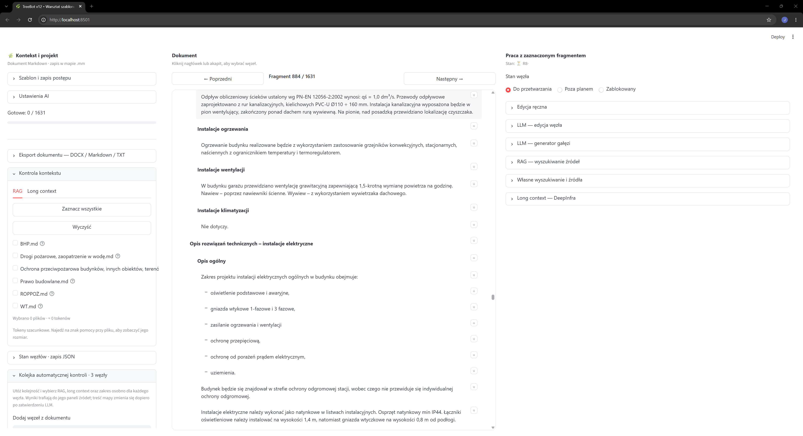
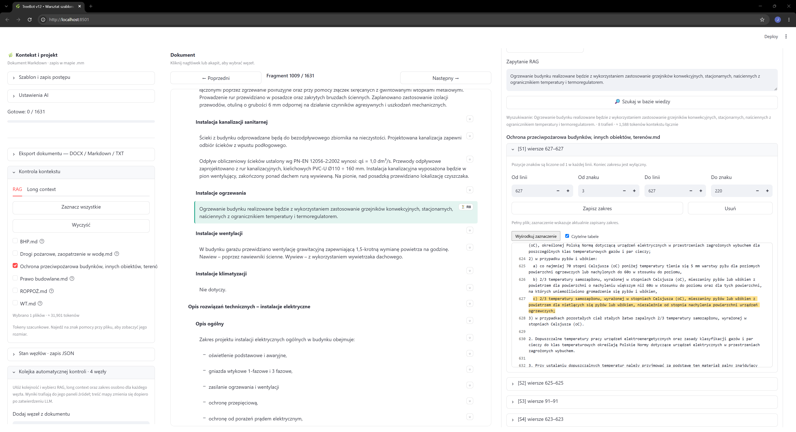

# TreeBot Advanced

**TreeBot Advanced** to warsztat do analizy i opracowywania rozbudowanych formularzy oraz dokumentów przy wsparciu AI. Łączy pracę na strukturze dokumentu, wyszukiwanie źródeł metodą RAG, tryb długiego kontekstu i modele dostępne przez **DeepInfra API**.

Aplikacja pozwala pracować nad jednym akapitem, całym rozdziałem albo przejść przez formularz punkt po punkcie. Użytkownik decyduje, które fragmenty wymagają analizy, jakie materiały mają być brane pod uwagę i kiedy zapisać rezultat pracy modelu. Repozytorium przedstawia działanie aplikacji; nie zawiera jej kodu źródłowego.

## Interfejs

*Dokument pośrodku, ustawienia projektu i kontekstu po lewej oraz narzędzia dla zaznaczonego fragmentu po prawej.*

*Przykład wyszukiwania w bazie wiedzy: wyniki można otworzyć, sprawdzić w otoczeniu dokumentu i zawęzić do konkretnych linii oraz znaków.*

## Do czego służy?

W dużym formularzu pojedynczy punkt rzadko daje się ocenić w oderwaniu od reszty. Potrzebne są dane projektu, treść sąsiednich sekcji i właściwe materiały źródłowe. TreeBot Advanced zbiera te elementy w jednym miejscu.

Główne zastosowania:

- analiza kolejnych części formularza lub dokumentacji;
- wyszukiwanie przepisów, wytycznych i innych materiałów odnoszących się do wybranego fragmentu;
- porównywanie treści dokumentu z wybranymi źródłami;
- redagowanie istniejącego fragmentu z pomocą modelu;
- tworzenie nowych gałęzi i rozwinięć dokumentu;
- organizowanie automatycznej kontroli większej liczby węzłów;
- eksport opracowanego dokumentu do formatów użytkowych.

## Praca na całym formularzu

Dokument jest prezentowany jako uporządkowana struktura fragmentów. Kliknięcie nagłówka lub akapitu wybiera odpowiadający mu **węzeł**. Można przechodzić między węzłami, edytować je i śledzić postęp prac nad całym formularzem.

Każdy węzeł może mieć własny stan: **do przetwarzania**, **poza planem** albo **zablokowany**. Pozwala to określić zakres pracy przed uruchomieniem analizy. Licznik postępu pokazuje, ile fragmentów zostało już opracowanych.

Przy większych dokumentach pomocna jest **kolejka automatycznej kontroli**. Użytkownik układa kolejność węzłów i może dobrać dla nich RAG, long context oraz zakres analizy. Wyniki wyszukiwania trafiają do paneli źródeł danego węzła. Treść dokumentu zmienia się dopiero po zatwierdzeniu wyniku pracy modelu. Dzięki temu można przejść przez cały formularz, zachowując kontrolę nad poszczególnymi decyzjami.

Stan pracy można zapisać i później kontynuować. Aplikacja udostępnia również zapis stanu węzłów w formacie JSON.

## RAG — wyszukiwanie właściwych źródeł

**RAG** (*Retrieval-Augmented Generation*) pomaga odnaleźć w bazie wiedzy fragmenty związane z aktualnym pytaniem lub zaznaczonym węzłem. Zamiast podawać modelowi całą bibliotekę dokumentów, użytkownik może wybrać pliki źródłowe, uruchomić wyszukiwanie i sprawdzić znalezione treści przed ich wykorzystaniem.

Panel RAG pokazuje:

- wybór dokumentów, które mają uczestniczyć w wyszukiwaniu;
- szacunkową liczbę tokenów dla wybranych materiałów;
- zapytanie używane do wyszukania źródeł;
- listę trafień wraz z nazwą dokumentu;
- podgląd trafienia w otoczeniu sąsiednich wierszy;
- możliwość zapisania dokładnego zakresu źródła.

Zakres można zawęzić nie tylko do numerów wierszy, lecz także do pozycji znaków wewnątrz wiersza. Pozwala to wskazać konkretny przepis lub zdanie, zamiast przekazywać modelowi zbyt obszerny fragment. Podgląd wyróżnia wybrane miejsce w tekście. Użytkownik może poprawić lub usunąć zapisany zakres.

Obok wyszukiwania RAG dostępne są także narzędzia do **własnego wyszukiwania i dobierania źródeł**. Dają możliwość ręcznej kontroli materiałów używanych przy opracowywaniu danego punktu.

## Long context — szerszy materiał do analizy

Tryb **Long context — DeepInfra** służy do pracy z większą ilością materiału w ramach jednego zadania. Jest przydatny wtedy, gdy do oceny fragmentu dokumentu potrzebny jest szeroki opis projektu, dłuższy dokument albo kontekst obejmujący kilka powiązanych części.

RAG i long context można dobierać do charakteru zadania:

| Tryb | Kiedy pomaga |
| --- | --- |
| **RAG** | Gdy trzeba znaleźć najbardziej trafne fragmenty w większej bazie wiedzy. |
| **Long context** | Gdy model powinien rozpatrzyć szerszy, wskazany przez użytkownika materiał. |
| **Połączenie obu** | Gdy analiza wymaga zarówno ogólnego kontekstu sprawy, jak i precyzyjnych źródeł. |

Liczba materiałów możliwych do użycia jednocześnie zależy od limitów kontekstu wybranego modelu. Panel pokazuje szacunkową wielkość wybranych plików w tokenach, co pomaga kontrolować zakres zapytania.

## Integracja z DeepInfra API

TreeBot Advanced korzysta z **DeepInfra API** do zadań realizowanych przez modele AI. W ustawieniach można przygotować sposób pracy modelu, a w panelu zaznaczonego węzła uruchomić narzędzia do jego edycji lub rozbudowy.

W interfejsie dostępne są między innymi:

- **LLM — edycja węzła:** pomoc przy opracowaniu istniejącego fragmentu;
- **LLM — generator gałęzi:** tworzenie rozwinięcia w strukturze dokumentu;
- **Long context — DeepInfra:** analiza z użyciem szerszego kontekstu;
- **RAG — wyszukiwanie źródeł:** dobór materiałów dla bieżącego zagadnienia.

Wywołania modeli wymagają połączenia z usługą i mogą generować koszty zależne od liczby przetwarzanych tokenów. Dlatego TreeBot pokazuje szacunkowy rozmiar wybieranego kontekstu i pozwala ograniczać materiały do tych, które są rzeczywiście potrzebne.

## Kontrola użytkownika nad wynikiem

TreeBot Advanced wspiera przygotowanie analizy, ale nie zapisuje każdej sugestii modelu automatycznie do dokumentu. Użytkownik może najpierw sprawdzić źródła, ustawić zakres kontekstu i ocenić propozycję. Dopiero zatwierdzona treść staje się częścią opracowania.

To ważne zwłaszcza przy dokumentach technicznych i regulacyjnych, w których znaczenie ma dokładne brzmienie źródła oraz aktualność użytych materiałów. Wyniki AI należy zawsze poddać przeglądowi merytorycznemu.

## Eksport i dalsza praca

Po opracowaniu formularza dokument można wyeksportować jako **DOCX, Markdown lub TXT**. Pozwala to kontynuować redakcję w innych narzędziach, przekazać materiał do przeglądu albo przygotować wersję końcową.

TreeBot łączy więc trzy etapy pracy w jednym interfejsie: **wybór i kontrolę źródeł, opracowywanie węzłów oraz eksport całego dokumentu**.
